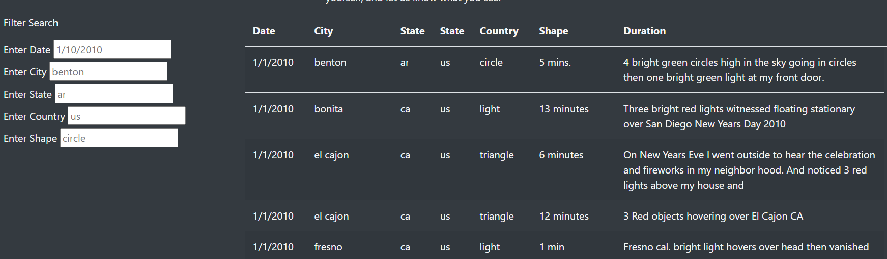
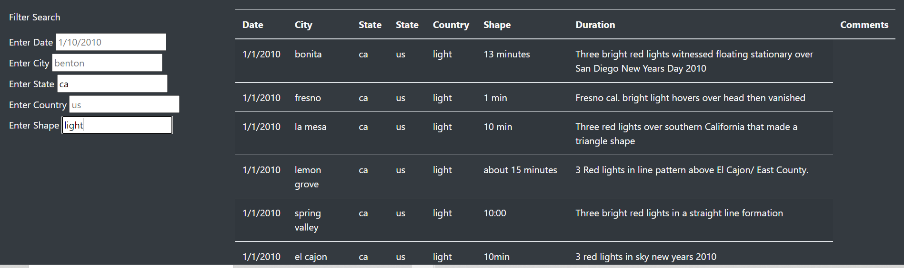

# UFOs

The website is deployed on github pages on the following link: https://mobinapiracha.github.io/UFOs/

## Overview 
In this project we will assume the role of Data Journalist who is interested in using dynamic webpages to create an article and present data on UFO sightings. We will use Javascript in combination with HTML, CSS and Bootstrap to create a dynamic webpages which will display our article on UFOs along with some data presented in a table. Our table will include interactive features such as a filters tab for our table which allows users to refine their search. Therefore we will present our article, our table of data that supports our findings and easy to use filters in an visually appealing HTML page. Our end result will be a presentation of data that is visually appealing and interactive. 

## Results
* Created a dynamic webpage with Javascript, HTML, CSS and Bootstrap, posting our UFO article along with our data into the webpage and adding a filter criteria for Date, City, State, Country and Shape so users can filter for specific sightings. 
*  To search for a particular UFO sighting, please look at the image below

#### Search Crtiera 

Here we have a our webpage with the data and the search filters. We have placeholders in our filters as an example of how to carry out a search. Now to filter our search we will simply go to any of our search bars, type our criteria and enter it. For example if I want to search for sightings in California in the shape of a light, we will simply type "ca" as our state and "light" as our shape and press enter, we see our search filtered to all reported sightings in California in form of a light shape. 

Therefore, as we can see with the help of Javascript, specifically the D3 feature, we have managed to import a dataset into our webpage and also created a filter feature which enables us to filter our data according to our own critera. 

## Summary 
This webpage does a great job in presenting our data and allows users to filter through it. Bootstrap and CSS allows us to make our webpage more visually appealing. However, there are some drawbacks of this webpage. As useful as the data is, our webpage lacks any visualizations that might help us summarize the data better, in terms of where we have the most sightings, which are the most frequently occuring shapes etc. Therefore, one recommendation for this webpage could be to create a few visualizations that may help summarize the data and help users find specific features to look for. In addition, it might be useful to also add some metrics in article. The article talks about providing access to data but leaves it for the users to find what they need instead of providing some data analysis metrics. Therefore, providing some of our own insights about the data along with some visuals will help users better understand the data. 
